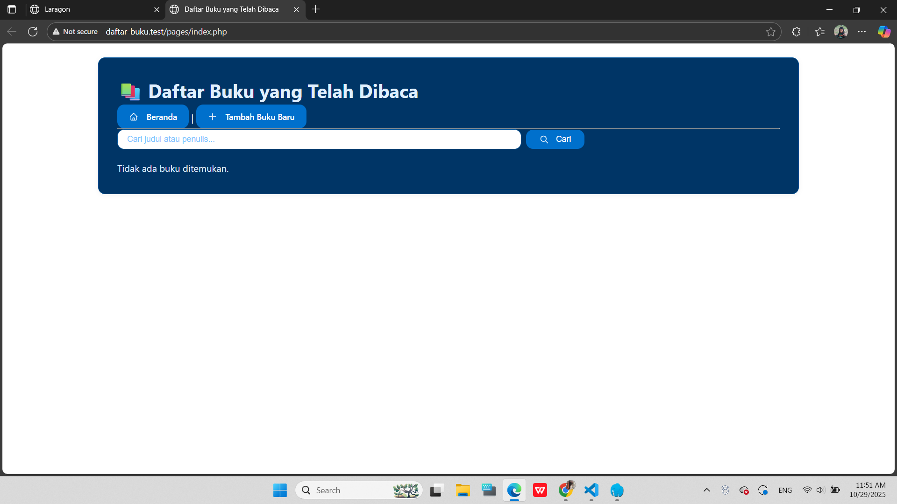

# Daftar Buku yang Telah Dibaca

Aplikasi sederhana berbasis PHP Native dan MySQL untuk mencatat buku yang telah dibaca, dengan fitur CRUD lengkap, pencarian, dan pagination.

## Fitur

- Tambah, lihat, edit, dan hapus buku
- Validasi input (judul & penulis wajib)
- Pencarian berdasarkan judul atau penulis
- Pagination (5 data per halaman)
- Keamanan: PDO prepared statement, sanitasi input/output
- Antarmuka pengguna sederhana dan responsif

## Kebutuhan Sistem

- PHP ≥ 8.0
- MySQL 5.7+
- Web server Laragon

## Instalasi

1. Salin folder proyek ke direktori web server (misal: `htdocs/daftar-buku`).
2. Buat database MySQL bernama `daftar_buku`.
3. Jalankan skrip SQL berikut di phpMyAdmin atau MySQL CLI:
   ```sql
   CREATE DATABASE IF NOT EXISTS daftar_buku CHARACTER SET utf8mb4 COLLATE utf8mb4_unicode_ci;
   USE daftar_buku;
   CREATE TABLE books (
       id INT AUTO_INCREMENT PRIMARY KEY,
       title VARCHAR(255) NOT NULL,
       author VARCHAR(255) NOT NULL,
       summary TEXT,
       created_at DATETIME DEFAULT CURRENT_TIMESTAMP,
       updated_at DATETIME DEFAULT CURRENT_TIMESTAMP ON UPDATE CURRENT_TIMESTAMP
   );
   ```

## Struktur folder

daftar-buku/
│
├── config/
│ └── database.php
│
├── includes/
│ └── header.php
│
├── pages/
│ ├── index.php
│ ├── create.php
│ ├── edit.php
│ ├── view.php
│ └── delete.php
│
├── assets/
│ └── style.css
│
├── index.php
└── README.md

## Konfigurasi Database

$host = 'localhost';
$dbname = 'daftar_buku';
$username = 'root';
$password = '';

## Screenshoot

